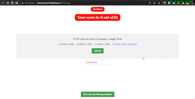

# MCQ Practice Web App

This is my first web application designed to help me and my classmates practice Multiple Choice Questions (MCQs) by providing randomized questions sourced from an API or a static file. It's my first frontend app and is built using HTML, CSS, and JavaScript.

---

## Live Demo

  

   

You can access a live demo of the app [Here](https://ahmedessam139.github.io/MCQ_Test).

---

## Features

- Fetches questions from an API or reads them from a static file.
- Randomizes the questions to provide a varied practice experience.
- User-friendly interface for easy navigation and interaction.
- Designed specifically for my classmates to help improve our knowledge and test-taking skills.

---

## Getting Started

To set up and run the web app locally, follow these steps:

1. Clone this repository to your local machine.
2. Open the `index.html` file in a web browser.
3. Start practicing MCQ questions right away!

---
## Usage

Once you have the web app running, follow these steps to start practicing:

1. Select the source of questions (API or static file).
3. Answer the questions displayed on the screen.
4. After answering all questions, view your results.

---

